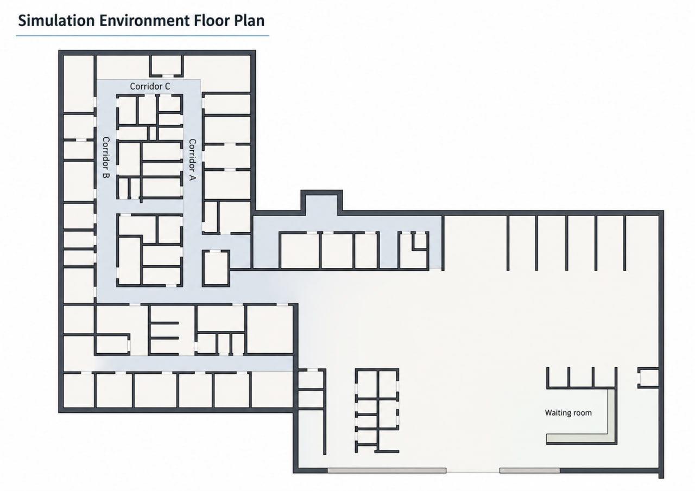
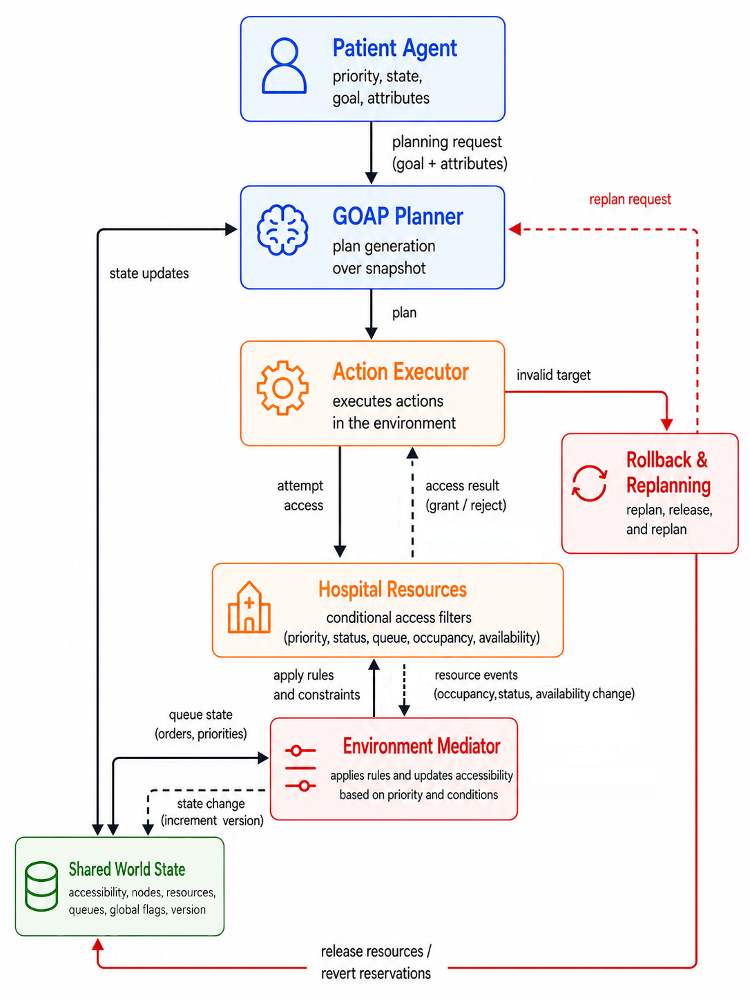
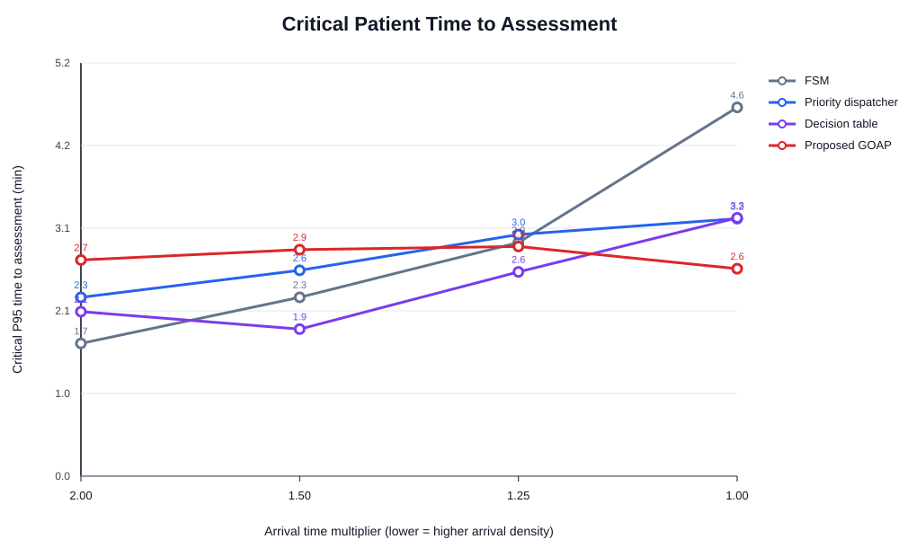
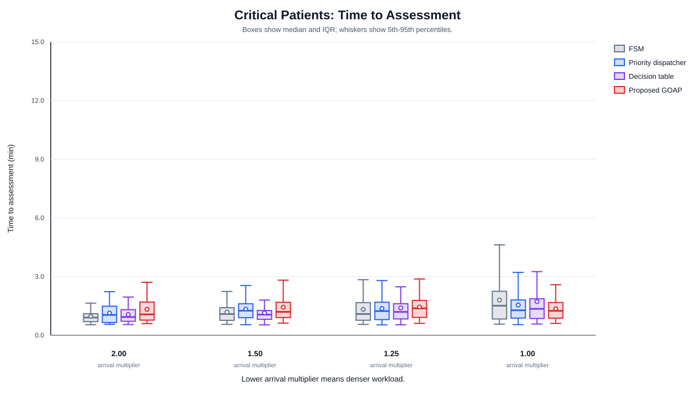
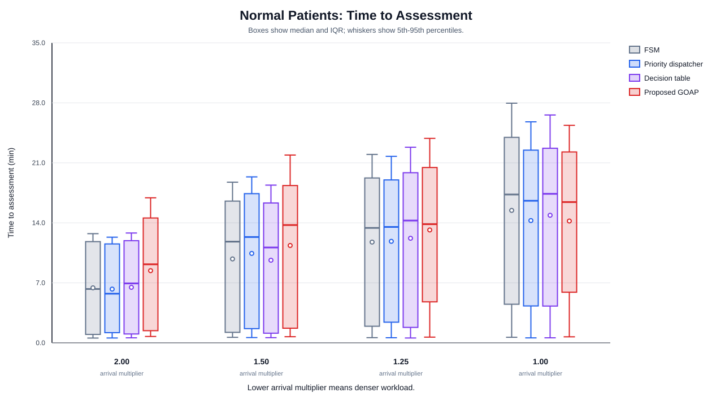
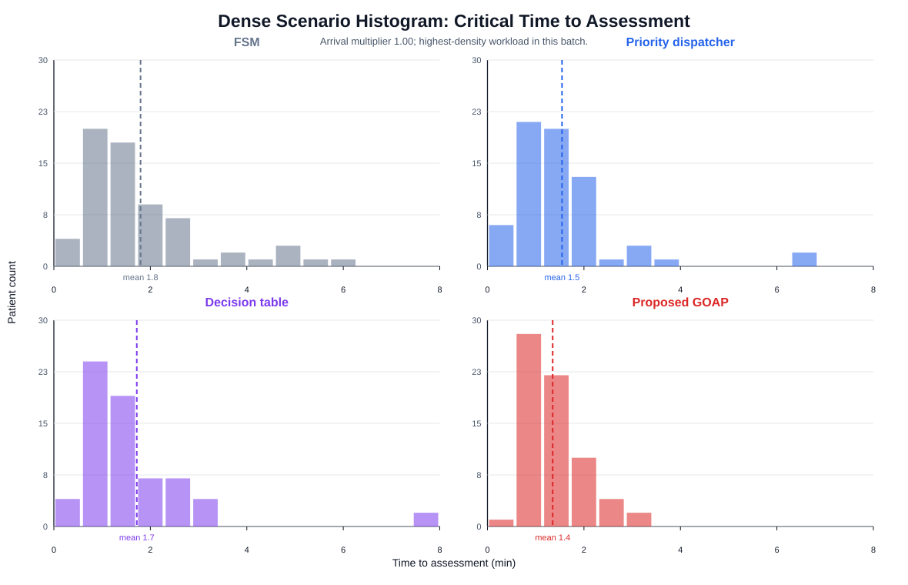
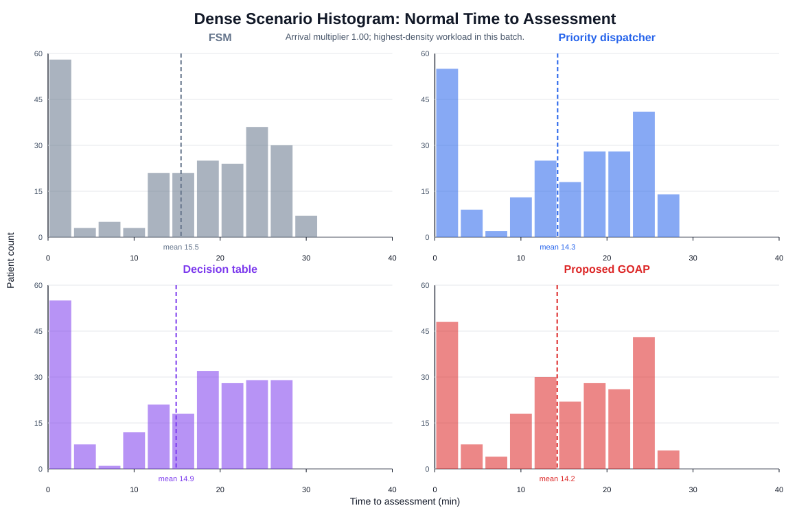

# Environment-Mediated GOAP for Dynamic Triage Transport

This repository presents a Unity-based triage transport simulation and a priority-aware online replanning controller. The proposed method is compared against three baseline controllers under a MIMIC-IV-ED demo-informed synthetic transport workload.

The core question is whether environment-mediated replanning can reduce delay for critical patients while preserving overall throughput under dense arrivals, shared corridors, limited cubicles, and temporary route conflicts.

## Simulation Environment

The environment contains a waiting room, two assessment wings, shared cubicles, corridor nodes, alternative detours, and emergency fallback areas. Corridors and resource nodes can be opened, closed, or filtered by patient priority, queue position, occupancy, and current flow-control mode.



## Emergency Fallback Demo

When a corridor or exit becomes unavailable during transport, affected agents move to the nearest emergency waiting area instead of blocking the corridor. When a valid route becomes available again, the controller resumes normal behavior.


## Controller Architecture

The proposed controller does not create a separate private world-state object for every patient. Instead, an environment mediator updates shared resource accessibility and node-level access filters. Personalization emerges because agents with different priority labels, queue positions, and internal states evaluate the same environment differently.



## Compared Controllers

| Controller | Description |
|---|---|
| FSM / Reactive controller | Local baseline with fixed state transitions and no multi-step online planning. |
| Priority Queue Dispatcher | Centralized priority assignment with queue-based resource reservation. |
| Decision Table Controller | Rule-based baseline using priority, resource availability, conflict, and buffer conditions. |
| Proposed Environment-Mediated GOAP | Online planner with rollback, resource release, shared world-state versioning, and conditional resource access. |

## Dataset and Workload

The workload is a **MIMIC-IV-ED demo-informed synthetic triage transport trace**. It is not a full MIMIC-IV-ED clinical cohort and should not be described as clinical validation data. The public demo style is used to generate a reproducible transport-control workload with emergency-department-like arrivals and triage metadata.

Standalone files are in [`docs/dataset`](docs/dataset/). The Unity-compatible runtime schedule is [`docs/dataset/unity_runtime_schedule.csv`](docs/dataset/unity_runtime_schedule.csv).

| Parameter | Value |
|---|---|
| Workload source | MIMIC-IV-ED demo-informed synthetic trace / stress-test schedule |
| Scheduled arrivals per run | 300 patients |
| Priority mix | 67 critical (22.3%), 233 normal (77.7%) |
| Base arrival window | 20 min at multiplier 1.00 |
| Arrival time multipliers | 2.00, 1.50, 1.25, 1.00 (lower value = denser arrivals) |
| Assessment resources | 30 cubicles total: 15 right, 15 left |
| Triage/contact duration | 2-5 min, mean 206.23 s |
| Run stopping rule | Until all scheduled patients reached home |
| Simulation acceleration | Time.timeScale = 10 |

## Main Result

The result is load-dependent. At lighter loads, the proposed controller has overhead because it keeps critical-access structure active and performs more world-state updates. At the densest load, the same mechanism reduces critical access delay and slightly improves overall completion time relative to the strongest baseline.

At multiplier `1.00`, Proposed GOAP completed all 300 patients in `50.81 min`, compared with `50.83 min` for the best baseline. Critical mean time to assessment improved from `1.55 min` to `1.35 min`, and critical P95 improved from `3.24 min` to `2.61 min`.

## Figures














## Completion and Throughput

| Arrival multiplier | Controller | Completed patients | Completion time (min) | Throughput (patients/hour) | Mean total time (min) | P95 total time (min) | World-state changes | Max queue |
|---:|---|---:|---:|---:|---:|---:|---:|---:|
| 2.00 | FSM | 300 | 55.95 | 321.7 | 9.10 | 17.00 | 2572 | 83 |
| 2.00 | Priority dispatcher | 300 | 55.38 | 325.0 | 9.04 | 16.35 | 2612 | 84 |
| 2.00 | Decision table | 300 | 55.60 | 323.8 | 9.19 | 16.94 | 2594 | 84 |
| 2.00 | Proposed GOAP | 300 | 61.26 | 293.8 | 10.76 | 20.57 | 3988 | 103 |
| 1.50 | FSM | 300 | 53.23 | 338.1 | 11.85 | 22.53 | 2632 | 122 |
| 1.50 | Priority dispatcher | 300 | 53.95 | 333.6 | 12.41 | 23.31 | 2708 | 124 |
| 1.50 | Decision table | 300 | 52.67 | 341.7 | 11.74 | 22.18 | 2532 | 120 |
| 1.50 | Proposed GOAP | 300 | 57.52 | 312.9 | 13.03 | 25.92 | 3922 | 131 |
| 1.25 | FSM | 300 | 51.83 | 347.3 | 13.55 | 25.60 | 2516 | 140 |
| 1.25 | Priority dispatcher | 300 | 51.16 | 351.9 | 13.70 | 25.62 | 2530 | 141 |
| 1.25 | Decision table | 300 | 52.03 | 345.9 | 14.02 | 26.37 | 2590 | 139 |
| 1.25 | Proposed GOAP | 300 | 54.50 | 330.3 | 14.50 | 27.63 | 3890 | 155 |
| 1.00 | FSM | 300 | 53.18 | 338.5 | 16.88 | 31.16 | 2528 | 163 |
| 1.00 | Priority dispatcher | 300 | 50.83 | 354.1 | 15.82 | 29.33 | 2488 | 158 |
| 1.00 | Decision table | 300 | 51.75 | 347.9 | 16.24 | 30.27 | 2594 | 160 |
| 1.00 | Proposed GOAP | 300 | 50.81 | 354.2 | 15.25 | 28.84 | 3252 | 165 |

## Access and Protocol Metrics

| Arrival multiplier | Controller | Mean time to assessment (min) | P95 time to assessment (min) | Critical mean (min) | Critical P95 (min) | Normal mean (min) | Normal P95 (min) | >15 min all (%) | >15 min critical (%) | Contact >5 min (%) |
|---:|---|---:|---:|---:|---:|---:|---:|---:|---:|---:|
| 2.00 | FSM | 5.20 | 12.67 | 0.97 | 1.67 | 6.42 | 12.80 | 0.00 | 0.00 | 0.00 |
| 2.00 | Priority dispatcher | 5.12 | 12.26 | 1.14 | 2.25 | 6.27 | 12.34 | 0.00 | 0.00 | 0.00 |
| 2.00 | Decision table | 5.27 | 12.72 | 1.06 | 2.07 | 6.48 | 12.82 | 0.00 | 0.00 | 0.00 |
| 2.00 | Proposed GOAP | 6.84 | 16.73 | 1.32 | 2.72 | 8.42 | 17.00 | 15.67 | 0.00 | 0.00 |
| 1.50 | FSM | 7.87 | 18.66 | 1.18 | 2.25 | 9.79 | 18.77 | 26.33 | 0.00 | 0.00 |
| 1.50 | Priority dispatcher | 8.40 | 19.20 | 1.33 | 2.59 | 10.43 | 19.38 | 29.67 | 0.00 | 0.00 |
| 1.50 | Decision table | 7.74 | 18.32 | 1.14 | 1.85 | 9.64 | 18.42 | 25.33 | 0.00 | 0.00 |
| 1.50 | Proposed GOAP | 9.14 | 21.75 | 1.43 | 2.85 | 11.36 | 22.05 | 32.00 | 0.00 | 0.00 |
| 1.25 | FSM | 9.43 | 21.47 | 1.32 | 2.94 | 11.76 | 22.34 | 34.67 | 0.00 | 0.00 |
| 1.25 | Priority dispatcher | 9.50 | 21.63 | 1.37 | 3.04 | 11.84 | 21.78 | 35.67 | 0.00 | 0.00 |
| 1.25 | Decision table | 9.79 | 22.65 | 1.40 | 2.57 | 12.20 | 22.82 | 36.00 | 0.00 | 0.00 |
| 1.25 | Proposed GOAP | 10.55 | 23.54 | 1.44 | 2.89 | 13.17 | 23.98 | 37.67 | 0.00 | 0.00 |
| 1.00 | FSM | 12.40 | 27.70 | 1.80 | 4.64 | 15.45 | 27.97 | 46.33 | 0.00 | 0.00 |
| 1.00 | Priority dispatcher | 11.43 | 25.64 | 1.55 | 3.24 | 14.27 | 25.82 | 42.33 | 0.00 | 0.00 |
| 1.00 | Decision table | 11.95 | 26.45 | 1.72 | 3.25 | 14.89 | 26.69 | 43.33 | 0.00 | 0.00 |
| 1.00 | Proposed GOAP | 11.34 | 25.28 | 1.35 | 2.61 | 14.21 | 25.39 | 40.00 | 0.00 | 0.00 |

## Proposed Controller vs Best Baseline

| Arrival multiplier | Best baseline critical mean | Critical mean: proposed vs best baseline (min) | Critical mean improvement (%) | Best baseline critical P95 | Critical P95: proposed vs best baseline (min) | Critical P95 improvement (%) | Best baseline finish | Finish time: proposed vs best baseline (min) | Finish-time improvement (%) |
|---:|---|---|---:|---|---|---:|---|---|---:|
| 2.00 | FSM | 1.32 vs 0.97 | -36.1 | FSM | 2.72 vs 1.67 | -62.9 | Priority dispatcher | 61.26 vs 55.38 | -10.6 |
| 1.50 | Decision table | 1.43 vs 1.14 | -25.4 | Decision table | 2.85 vs 1.85 | -54.1 | Decision table | 57.52 vs 52.67 | -9.2 |
| 1.25 | FSM | 1.44 vs 1.32 | -9.1 | Decision table | 2.89 vs 2.57 | -12.5 | Priority dispatcher | 54.50 vs 51.16 | -6.5 |
| 1.00 | Priority dispatcher | 1.35 vs 1.55 | 12.9 | Priority dispatcher | 2.61 vs 3.24 | 19.4 | Priority dispatcher | 50.81 vs 50.83 | 0.0 |

## Normal Patient Delay Penalty

| Arrival multiplier | Proposed normal mean (min) | Baseline average normal mean (min) | Mean penalty vs baseline average (min) | Proposed normal P95 (min) | Baseline average normal P95 (min) | P95 penalty vs baseline average (min) |
|---:|---:|---:|---:|---:|---:|---:|
| 2.00 | 8.42 | 6.39 | 2.03 | 17.00 | 12.65 | 4.35 |
| 1.50 | 11.36 | 9.95 | 1.41 | 22.05 | 18.86 | 3.19 |
| 1.25 | 13.17 | 11.93 | 1.24 | 23.98 | 22.31 | 1.67 |
| 1.00 | 14.21 | 14.87 | -0.66 | 25.39 | 26.83 | -1.44 |

## Build and Release

The Windows build is not committed as raw Unity files because `UnityPlayer.dll`, `*_Data`, and runtime folders are build artifacts. They should be attached as a GitHub Release asset.

Recommended release file:

```text
GOAPproject_release.zip
```

The repository contains the documentation, figures, tables, and supplementary dataset. The build archive can be attached separately through GitHub Releases.

## Repository Structure

```text
README.md                       Main project page with figures and tables
docs/
  assets/                       Figures, screenshots, GIF demo, and chart assets
  dataset/                      Supplementary synthetic workload package
analysis_outputs/               Exported analysis tables and plots
tools/                          Dataset and figure generation scripts
```

## Scope Note

This project evaluates simulated patient transport and dynamic routing behavior. It does not validate clinical triage policy, patient outcomes, or real emergency-department treatment quality.


## Contributors

* Gleb Bondarenko
* Anastasia Popova
* Alyona Syrykh


