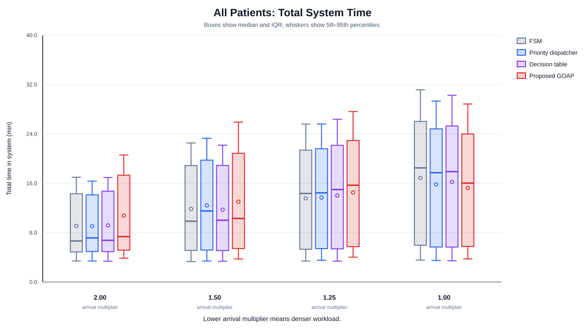

# Distribution Figures and Captions

## Figure D1

**Caption.** Patient-level distribution of time to assessment for critical patients. Boxes show the interquartile range and median; whiskers show the 5th-95th percentile range. The proposed controller shows the lowest critical-patient tail latency in the densest workload condition.

## Figure D2

**Caption.** Patient-level distribution of time to assessment for normal-priority patients. This figure shows the fairness cost of critical-priority routing under moderate loads and its disappearance in the densest workload.

## Figure D3

**Caption.** Distribution of total patient system time from arrival to home completion. This complements the aggregate completion-time table by showing patient-level spread rather than only the final run duration.

## Figure D4

**Caption.** Histogram of critical-patient time to assessment in the densest workload condition (arrival multiplier 1.00). Dashed vertical lines mark controller-specific means.

## Figure D5

**Caption.** Histogram of normal-patient time to assessment in the densest workload condition (arrival multiplier 1.00). This view makes the normal-patient waiting-time trade-off visible as a distribution rather than as a single average.
