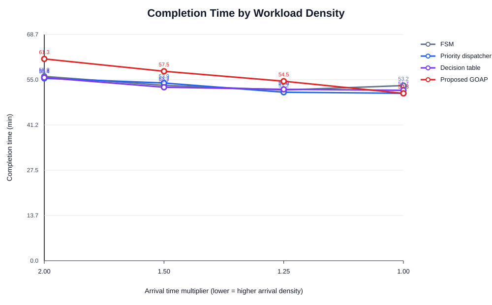
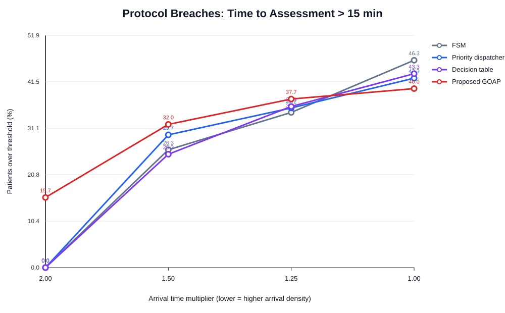
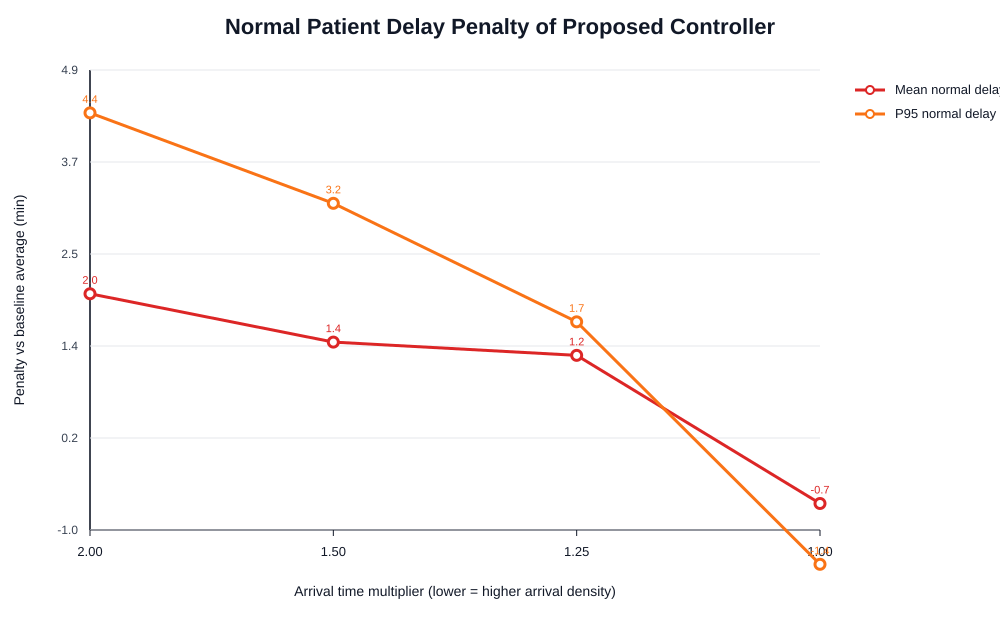

# Results Figures and Captions

## Figure 1

**Caption.** Total simulated time required for each controller to complete all 300 scheduled arrivals. The arrival multiplier stretches the same arrival trace; therefore, lower values correspond to denser workload conditions.

## Figure 2

**Caption.** P95 time to assessment for critical patients. Under the densest workload (arrival multiplier 1.00), the proposed environment-mediated GOAP controller produced the lowest critical tail latency.

## Figure 3

**Caption.** Percentage of patients whose estimated time to assessment exceeded the 15 min threshold. No critical patient exceeded the threshold in any run; breaches were caused by normal-priority patients.

## Figure 4

**Caption.** Additional waiting cost imposed on normal patients by the proposed controller relative to the average of the three baselines. Positive values indicate delayed normal patients; negative values indicate lower waiting time than the baseline average.
